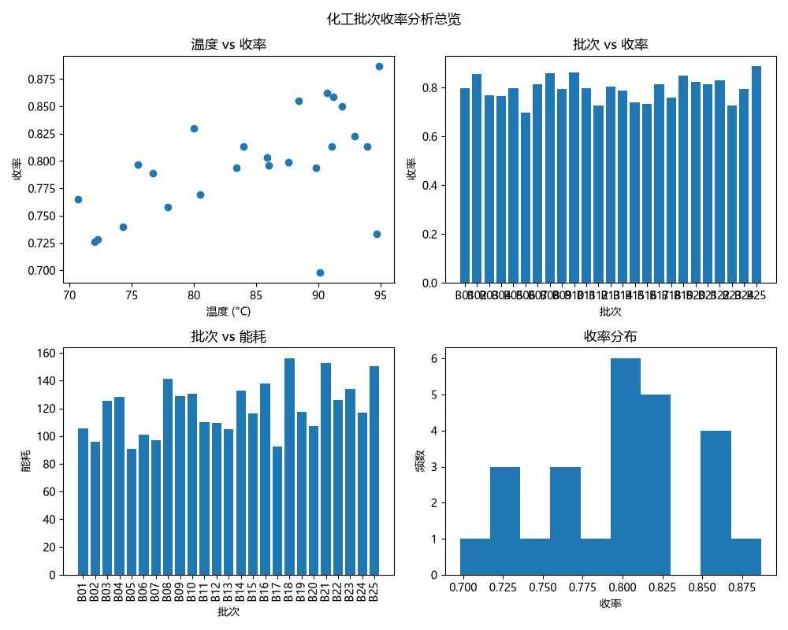

# 化工批次收率分析

一个用 Python 分析化工批次数据的小项目：读取数据文件，算统计、筛异常、画多张图，一键出分析结果。

## 功能

- 读取批次数据（温度、压力、收率、能耗）
- 计算各参数统计（平均值、最高/最低、总能耗）
- 自动筛出"低收率"的异常批次
- 计算温度-收率、压力-收率的相关系数（相关性分析）
- 多图整合：一张 2×2 大图展示温度-收率散点、批次-收率柱状、批次-能耗柱状、收率分布直方图
- 图表自动保存为 `.png`

## 怎么用

1. `pip install pandas matplotlib`
2. 准备 `yield_data.csv`（列：批次、温度、压力、收率、能耗）
3. 运行：`python yield_analysis.py`
4. 统计打印在终端，一张合并大图 `combined_analysis.png` 生成在当前文件夹

## 分析结果（示例）

- 温度与收率呈**中等正相关**（r≈0.52）：温度升高，收率总体升高，但影响中等，非决定性因素
- 压力与收率**基本无关**（r≈0.12）
- 结论：温度是影响收率的主要因素之一，但**非唯一**；收率还受其他未观察因素影响
- 自动筛出异常低收率批次，值得进一步排查
- 收率主要分布在 0.80 ~ 0.82

## 图表

## 技术栈

Python · pandas · matplotlib

## 后续可以改进

- 按分类/时间段做分组汇总
- 接更多指标（压力、能耗）的联合分析

## 许可

MIT License

## 作者

fantasy801
