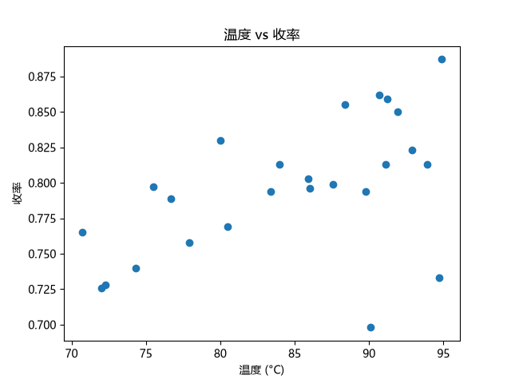
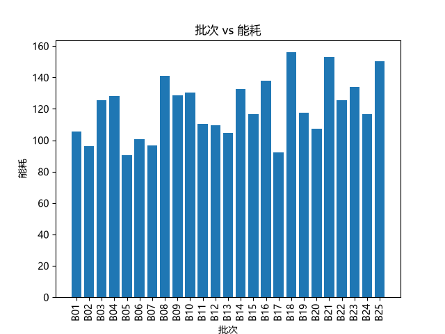
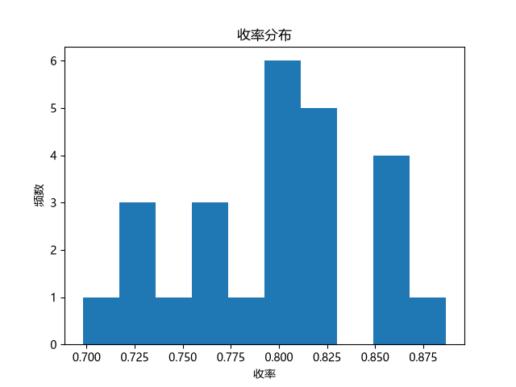

# 化工批次收率分析

一个用 Python 分析化工批次数据的小项目：读取数据文件，算统计、筛异常、画多张图，一键出分析结果。

## 功能

- 读取批次数据（温度、压力、收率、能耗）
- 计算各参数统计（平均值、最高/最低、总能耗）
- 自动筛出"低收率"的异常批次
- 画出 4 张图：温度-收率散点、各批收率柱状、各批能耗柱状、收率分布直方图
- 图表自动保存为 `.png`

## 怎么用

1. `pip install pandas matplotlib`
2. 准备 `yield_data.csv`（列：批次、温度、压力、收率、能耗）
3. 运行：`python yield_analysis.py`
4. 统计打印在终端，4 张图生成在当前文件夹

## 分析结果（示例）

- 温度越高，收率整体越高（见散点图）
- 发现几批异常低收率，值得进一步排查
- 收率主要分布在 0.80 ~ 0.82

## 图表

## 技术栈

Python · pandas · matplotlib

## 后续可以改进

- 加温度-收率的相关性分析
- 按分类/时间段做分组汇总
- 接更多指标（压力、能耗）的联合分析

## 许可

MIT License

## 作者

fantasy801
